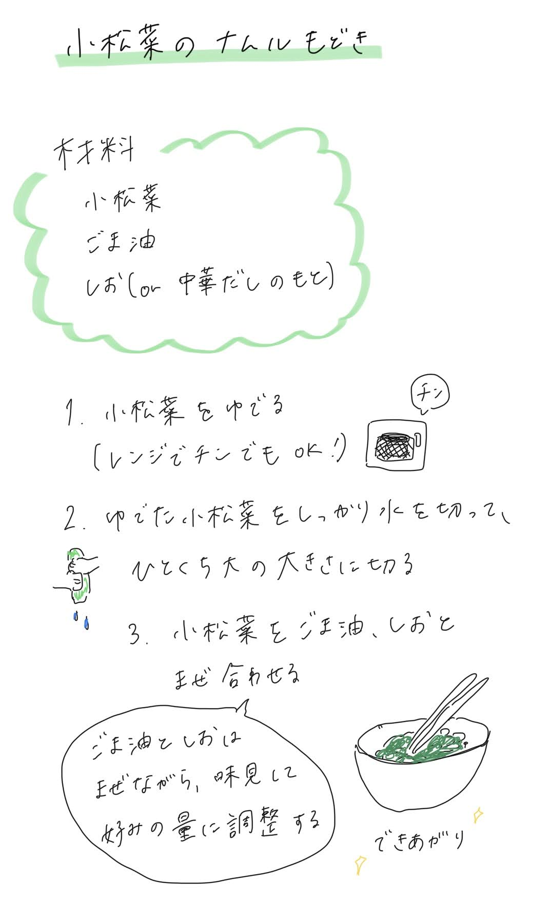

料理をするのが億劫なときでもこれなら作れるかもな、と思っているもの。

ナムルのいろんなレシピをうろ覚えかつごちゃ混ぜで作っているので、「もどき」。

そして「小松菜」とは書いているけど、たぶんもやし、ほうれん草、キャベツとかでも同じ要領でできる。  

## 材料
- 小松菜
- ゴマ油
- 塩 または 中華だしの素  
※調味料の量は野菜の量と好みに合わせて調整する

## 作り方
1. 小松菜をゆでる。
火が通ればいいので、レンジでもOK。
2. ゆでた小松菜をしっかり水を切って、ひとくち大の大きさに切る。
3. ゆでた小松菜をゴマ油、塩と混ぜ合わせる。  
ゴマ油と塩は和えながら味見して、好みの量に調整する。

