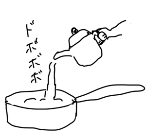

どこかで拾ってきたレシピなのだけど、もともとのレシピがわからず、自己流になりつつある...  
野菜を粗くみじん切りして作ることがほとんどなので、ちょっと気合が必要。

## 材料 (4人分くらい？)
- トマト...中2個
- にんじん...1本
- たまねぎ...中1個（大きくてもいいと思う）
- セロリ...1/2本
- にんにく...1片
- トマトペースト...18g
    - カゴメのトマトペーストが1袋18gなので
- ミネストローネに合いそうなハーブ（オレガノとかパセリとか...粉末のものを使っている）
- オリーブオイル...炒めるときに必要な分
- 水

### あってもなくてもよいもの
- ベーコン...1パック
- マギーブイヨンとか、コンソメスープの素とか
    - ベーコンとか肉系を入れないときに使う

## 作り方
1. たまねぎ、にんじん、セロリを粗いみじん切りにする。

2. にんにくもついでにみじん切りしておく。
3. トマトを一口大くらいに切っておく。
4. ベーコンも一口大に切っておく。
5. オリーブオイルを鍋に入れ、1. でみじん切りにした野菜と 4. のベーコンを入れ、火が通るまで炒める。
6. 5.に 2.のニンニクのみじん切り、トマトペースト、ハーブを入れる。
7. 6.に水を注ぐ（ひたひたよりちょっと多いくらい）。

8. 3.のトマトを加えて、ぐつぐつ煮る。
9. 味見をしてみて、「なんかボヤっとした味だな...」と思ったら塩を足す。

貝の形のパスタとか、缶詰の豆とか、青菜を後から足して煮込んでも、おいしい。

## 他のレシピもあるよ
- [レシピ: 小松菜のナムルもどき](/ja/posts/cooking/2026-06-24_recipe_namul)