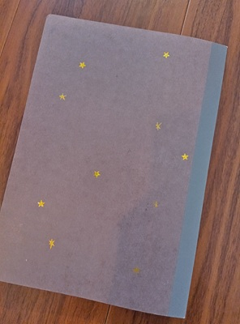
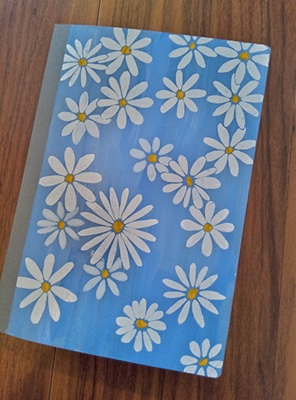
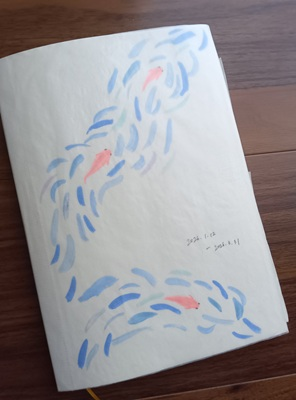
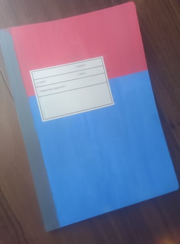

*Read the English version [here](/posts/crafting/2026-05-26_decorating_notebook_covers).*

去年からノートの表紙、裏表紙をデコり始めている。

最初はシールとペンを使うだけで、表紙・裏表紙の色は変えずにいたのだけど、

だんだんとアクリル絵の具を使って、表紙を塗りつぶしたり絵を描くようになっている。

  

  

こうやってノートをデコり始めると、ノートに「自分のもの」感が出てくるなと思う。  
（柄つきのノートだって売っているけれど、それは他の人が考えたデザインではないですか！）

デコることでよりノートに愛着が湧くし、愛着が湧くから使い終わったノートも手に取るようになった。

自分だけのノート、良いですよ！