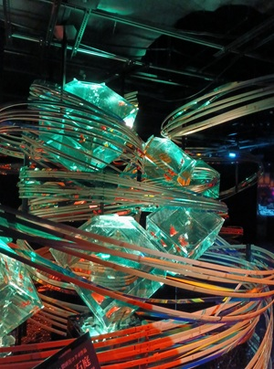
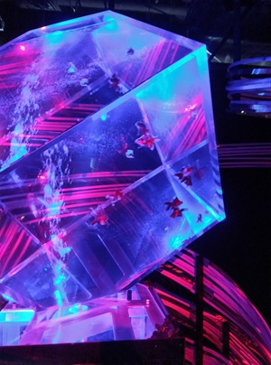
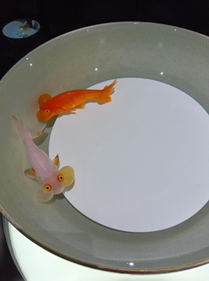
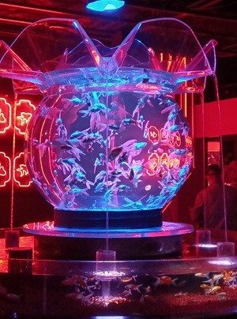
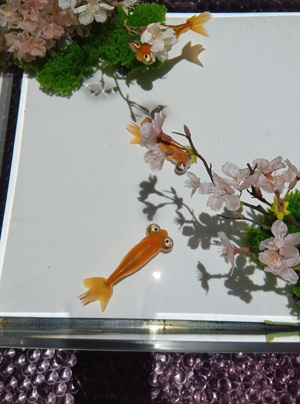
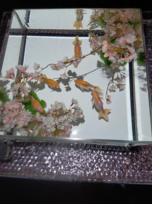
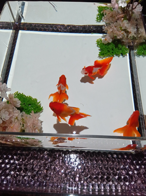

*Read the English version [here](/posts/photos/2026-06-26_art_aquarium_museum).*

今年の4月、銀座にある <a class="icon-new-tab" target="_blank" href="https://artaquarium.jp/">アートアクアリウム美術館</a> に行った。

たっくさんの金魚がいて、もうどこに行っても金魚。  
金魚しかいない!  
(一生分の金魚をみた気がする)

