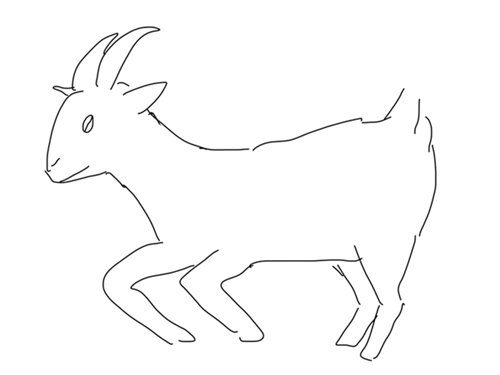

ヤギになってみた人のおはなし。

著者であるトーマス・トウェイツの前作『ゼロからトースターを作ってみた結果』を読んでいたから読もうと思ったのはあるけど...  
もうタイトルと表紙からしてね! 面白いの確定じゃない！
 
 

## 読んで思ったこと
- 相変わらず行動力がものすごいよな！
- トースターを作っていた前回よりも、身体面でしんどいことが多そうという印象。  
自分の健康をリスクにさらしてでも「ヤギになる」というプロジェクトを完遂しようとする力は一体どこから湧いてくるの...
- 最終的に本には載らなかった調査や作業とかもたくさんあったんだろうな、と。
- そしてやっぱり面白い。原書を読んでも絶対面白いんだろうな。
- このノリを訳すとすると結構悩みそうだな、と。訳した村井さんがスゴイ。
- 手を使わずに鉢に植わっている植物の葉っぱを食べた、子供の時の映像があるというエピソードが、もう、強すぎる...

 
 
今頃彼は新しいプロジェクトに取り組んでいるんだろうか？と思ったらヤギ以降もいろいろと作ったりしているみたい。  
Webサイトがありました。

<a class="icon-new-tab" target="_blank" href="https://www.thomasthwaites.com/">\< THOMAS THWAITES \></a>

 
 
最後にうろおぼえヤギを添えて。

## リンク
- <a class="icon-new-tab" target="_blank" href="https://www.thomasthwaites.com/">\< THOMAS THWAITES \></a>(閲覧日: 2026-07-26)
- <a class="icon-new-tab" target="_blank" href="https://www.shinchosha.co.jp/book/220003/">『人間をお休みしてヤギになってみた結果』 トーマス・トウェイツ、村井理子／訳</a> 新潮社 (閲覧日: 2026-07-26)

## 関連
- [2026年7月に消費したメディア記録](/ja/posts/lifelog/2026/2026_july_media_log)