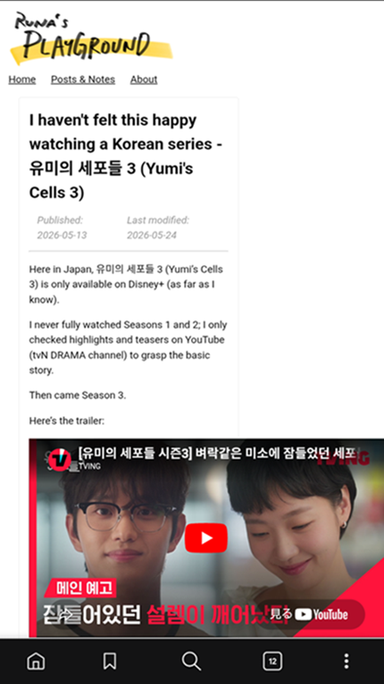

[この記事](/posts/tv-series/2026-05-13_yumis_cells3)のページの話。

## 起こっていたこと

ブラウザの横幅を縮小したり、スマホで表示したりすると、動画が親要素がはみ出てしまうようになっていたことに気づいた。  

こんな感じ。

  

YouTube の共有オプションのリストから **埋め込む** を選んで表示されるコード（`<iframe>`タグ）を貼り付けただけで、特に`<iframe>`タグに対してスタイルは適用していなかったので...

## やったこと

`<iframe>`タグに以下のcssスタイル適用。

```css
    iframe {
        width: 100%;
        height: 100%;
        aspect-ratio: 16 / 9;
    }
```

こうすると横幅を縮小しても、スマホで表示しても動画がはみ出なくなった!


## 参考文献
- 株式会社プレスマン <a class="icon-new-tab" target="_blank" href="https://www.pressman.ne.jp/archives/24873">YouTubeの埋め込み動画をCSSのみでレスポンシブ対応させる方法</a>  
(閲覧日: 2026-06-03)
- 株式会社シナジーメディア <a class="icon-new-tab" target="_blank" href="https://symedia.co.jp/879/">CSSでYouTubeの埋め込みを比率維持したままレスポンシブ対応させる方法</a>  
(閲覧日: 2026-06-03)
 