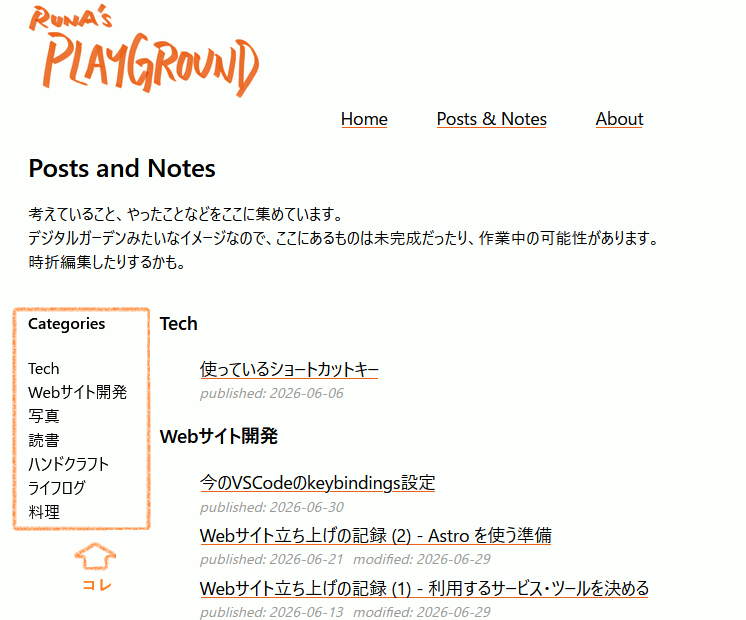

*Read the English version [here](/posts/web-dev/2026-06-25_adding_categories_section).*  

ちょっと前から [Posts and Notes](/ja/posts/) ページにcategoriesセクションをつけてみている。



カテゴリをクリックすると、そのカテゴリの記事へジャンプできるようなしくみ。  

ページ（HTML）の構成はこんな感じ↓


そして主なCSSはこちら。  
```css
div.container {
    display: flex;
}
aside {
    @media (width < calc(57rem)) {
        display: none;
    }
}
nav {
    position: sticky;
    overflow-y: auto;
    top: 0;
}
```
これはこのサイトを立ち上げたときから作りたかった機能ではあるのだけど、最近「これはいらないかも...」と感じ始めている。  

なんで、いらないかもと思うのか。  

上記のCSSではスクリーンの横幅が 57rem よりも小さいときに、この categories セクションが表示されないようにしている。  
このため、スマホでこのページにアクセスするとだいたい非表示になっているはずである。  

個人的には、ブログ記事を読むのはパソコンよりもスマホの方が多い。  
そうなると、パソコンとかタブレットでしか表示されない categories セクションってそもそもいるんだろうか？って思うのだ。  

もしかしたら、このページに categories セクションを追加するよりも、こっち ↓ みたいにしちゃう方がいいかしら、とか思っていて。

カテゴリをクリックすると、


カテゴリ内の記事が表示される。


この通りにページを変更するかどうかは、未定...

## Related
- [このサイトに加えたい機能](/ja/posts/web-dev/2026-05-30_features_to_add)