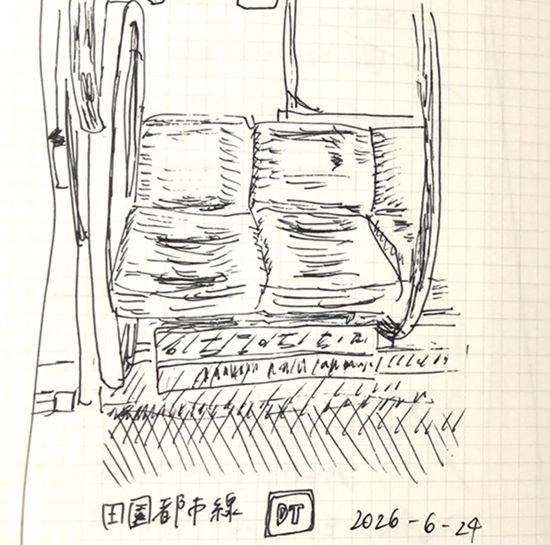
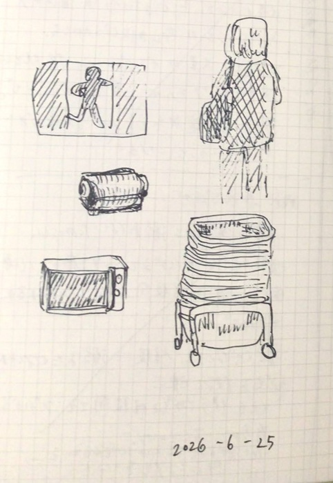
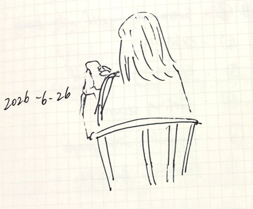

*[日本語で読む](/ja/posts/drawing/2026-08-03_sketches)*

## June 24 (on a train)

## June 25 (at a supermarket)

## June 26 (at a cafe)

## Related
- I used [KOKUYO Sokuryo Yacho](/posts/stationery/2026-07-27_sokuryo_yacho) to draw
- [Sketches (July 6 - July 15)](/posts/drawing/2026-08-03_sketches)