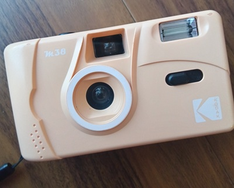

When I go on a trip, I prefer taking photos with a film camera to taking them with my phone.  

This is the one I use:  

**KODAK Film Camera M38**

Why do I prefer a film camera in the first place?  

Firstly, the camera of my phone is not as good as the latest ones, because when I bought my current phone two years ago I bought the cheapest one at the time.

Also, I love the specific atmosphere that only film cameras can give.  
I can apply filters after taking photos on the phone to make them look aesthetic, but it doesn't feel the same...

The first film camera I got was FUJIFILM's single use camera UtsuRundesu (写ルンです), I bought it when I was on a trip, and I loved how the photos turned out.  
I was fine with buying it every time I wanted to use a film camera, but I started to want one that I can use repeatedly.  
I don't remember why I ended up getting KODAK M38 though.

It costs much more than taking photos on the phone, and I sometimes fail taking them, but it feels nice to look back on photos I took with this camera.

It's one of the best things I've got.

## Links
- Jan Moren, <a class="icon-new-tab" target="_blank" href="https://janneinosaka.blogspot.com/2009/10/utsurundesu-fuji-one-use-camera.html">Utsurundesu - Fuji one-use camera</a> Janne In Osaka (last accessed: 2026-08-23)
    - If you want to know more about UtsuRundesu, I think this post helps a lot.

## Related

Photos I took with this camera:
- [Photos: Izumo, March 2025](/posts/photos/2026-08-06_izumo)
- [Photos: Kurashiki, March 2026](/posts/photos/2026-08-29_kurashiki)