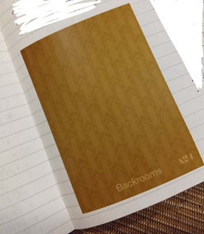

This month, I finally watched the movie "Backrooms".
Since [I watched the YouTube series in June](/posts/lifelog/2026/2026_june_media_log/), I had been wanting to watch it.

I had never watched a horror movie in a movie theater before, and I'm kind of glad that this time became my first.

I was surprised to see that there were not only adults but also kids in the audience. I wouldn't have been able to watch it if I was a kid(I heard a kid crying behind my seat when Captain Clark started chasing Mary. Poor kid).

It was exciting to find some elements that had appeared in the series! I could enjoy the movie more because I had watched the series beforehand.

However, I couldn't enjoy the first part of the movie to be honest...
I got pretty heavy motion sickness from the video footages. I felt conflicted because I wanted to get out and take breaks, but if I did I would have missed important scenes (as the story progressed I felt better and could focus on the screen).

Oh and I got a sticker when I passed the entrance!

## Related
- [Media Log (June 2026)](/posts/lifelog/2026/2026_june_media_log/)