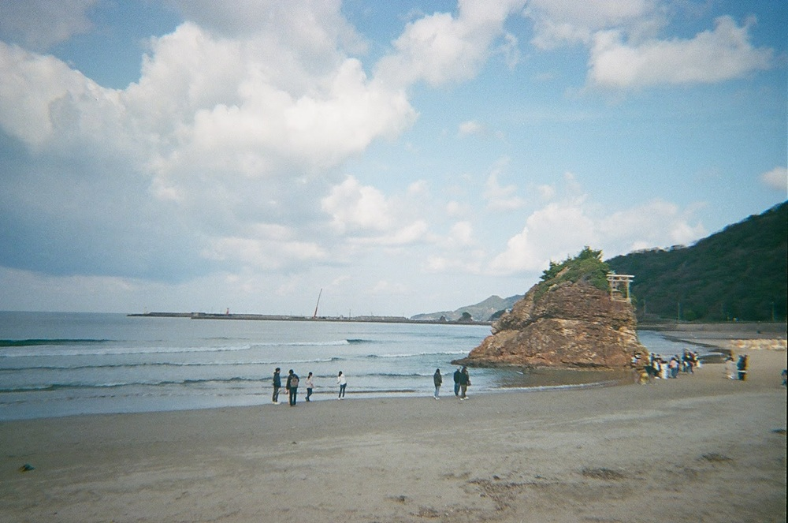
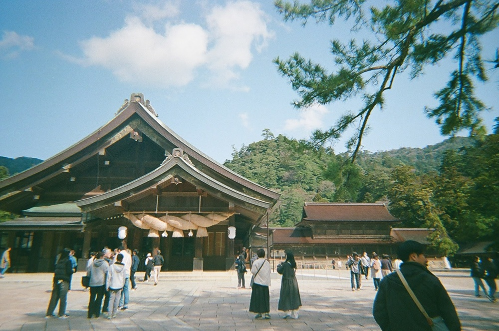
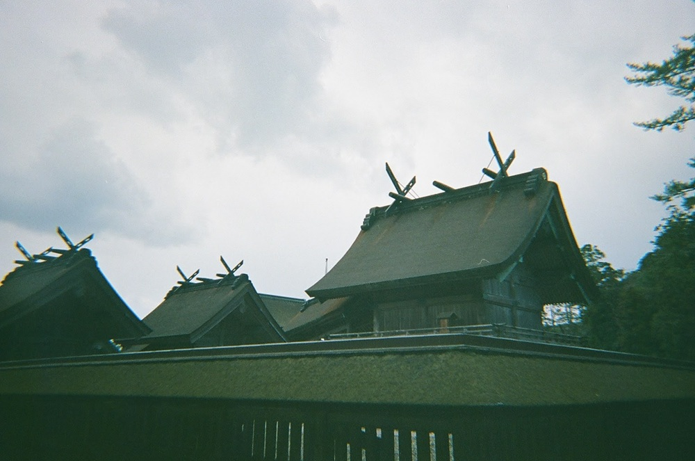
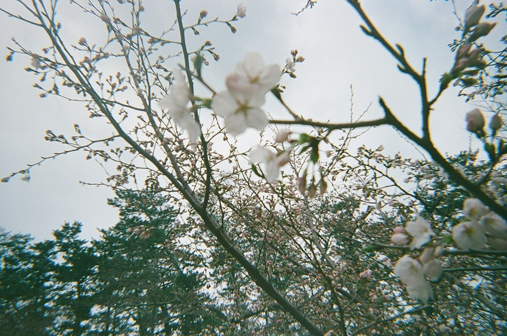
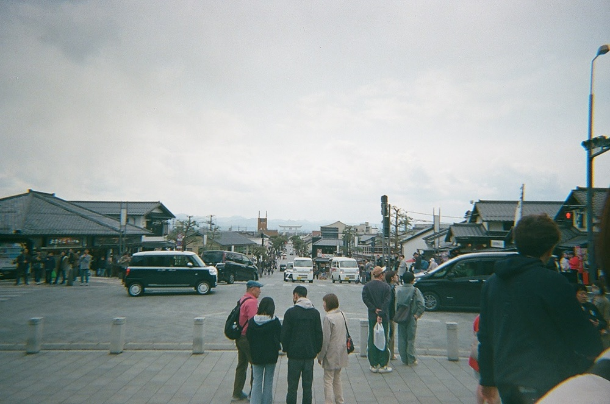

When I went on a trip to Izumo in March 2025, I took my Kodak Film Camera M38 with me.

Here are some of photos I took!

Inasa-no-hama Beach:

Izumo Taisha Grand Shrine:

The scenery from Izumo Taisha Grand Shrine's entrance:

## Links
- <a class="icon-new-tab" target="_blank" href="https://www.kankou-shimane.com/en/destinations/9309">Inasa-no-hama Beach | Shimane Japan Official Travel &amp; Tourism Guide</a>
- <a class="icon-new-tab" target="_blank" href="https://www.kankou-shimane.com/en/destinations/9282">Izumo Oyashiro Shrine(Izumo Taisha Grand Shrine) | Shimane Japan Official Travel &amp; Tourism Guide</a>
- <a class="icon-new-tab" target="_blank" href="https://www.japan.travel/en/destinations/chugoku/shimane/izumo/">Izumo | Shimane | Chugoku | Destinations | Travel Japan - Japan National Tourism Organization (Official Site)</a>