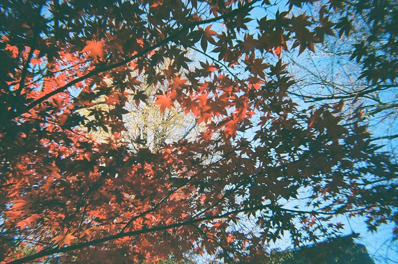
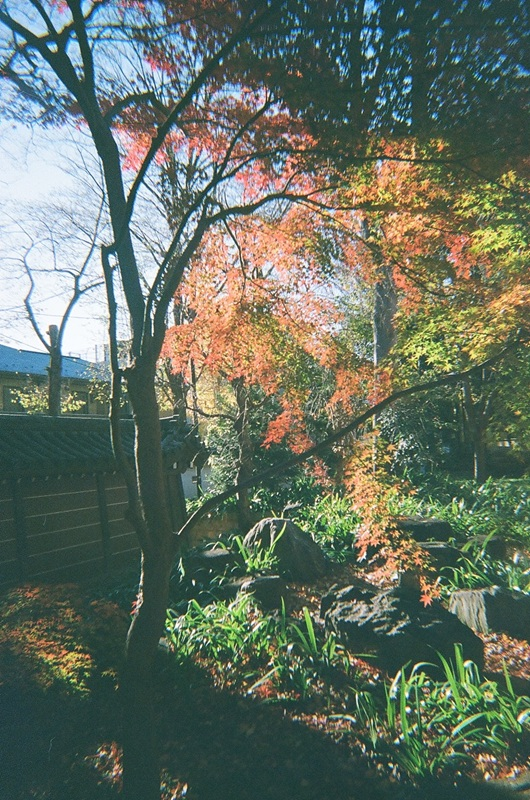
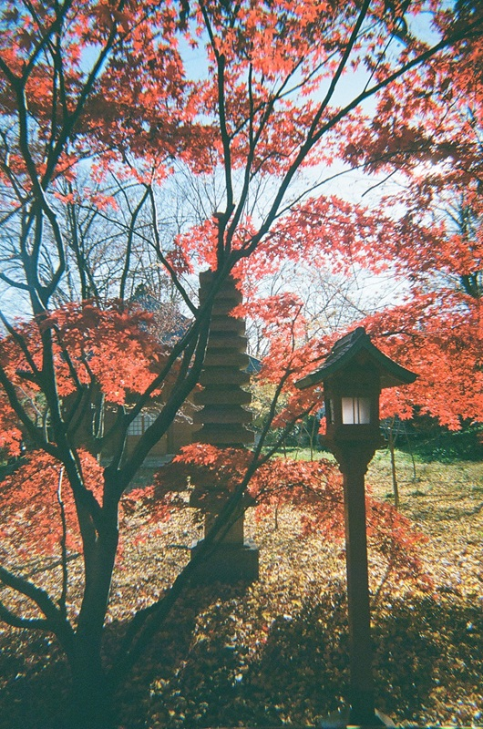
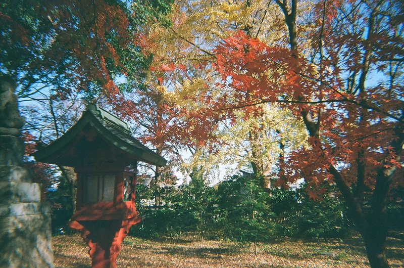
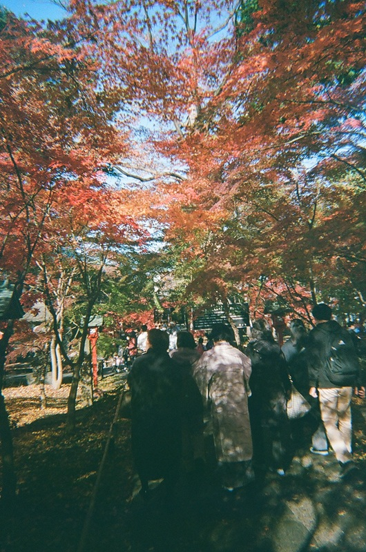
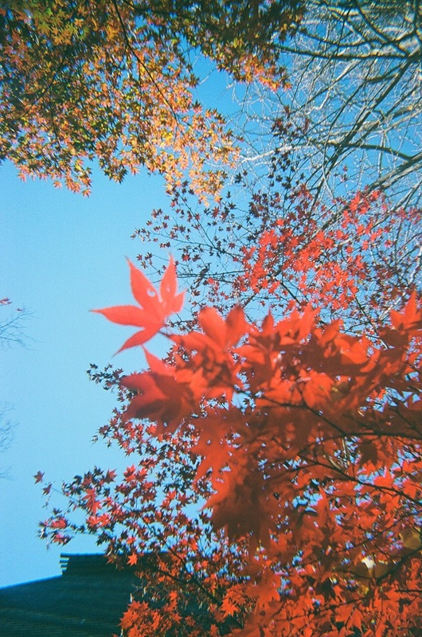

In winter of 2024 (I think it was December), I visited Kuhombutsu Joshin-ji Temple and took some photos with my [KODAK M38](/posts/lifelog/2026-08-27_film_camera/).

I love how some of the photos turned out so I figured I post them here!

## Links
- <a class="icon-new-tab" target="_blank" href="https://kuhombutsu.jp/">九品山 唯在念佛院 浄真寺</a> (last accessed: 2026-09-14)
    - The official website of Kuhombutsu Joshin-ji temple.
- Ways to Japan, <a class="icon-new-tab" target="_blank" href="https://thomasgittel.wordpress.com/2013/05/13/joshin-ji-kuhonbutsu-%E6%B5%84%E7%9C%9F%E5%AF%BA-%E4%B9%9D%E5%93%81%E4%BB%8F-2/">Jōshin-ji (Kuhonbutsu) – 浄真寺 (九品仏)</a> (last accessed: 2026-09-14)
    - I think it's worth checking this article if you want to know more about this temple!

## Related
- [My Favorite Belonging: KODAK Film Camera M38](/posts/lifelog/2026-08-27_film_camera/)