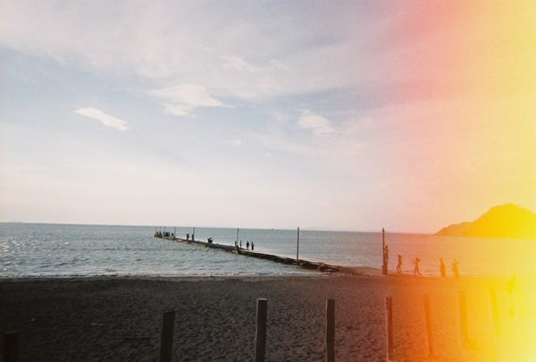
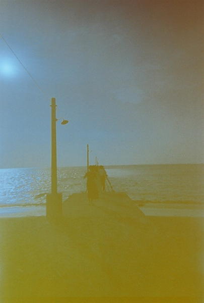
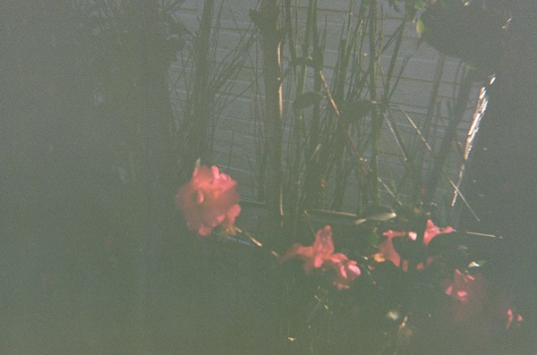
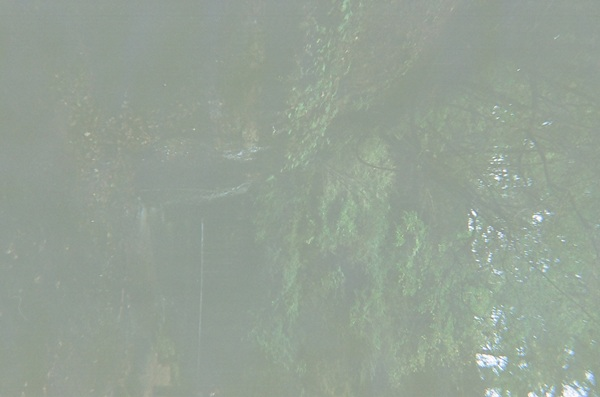
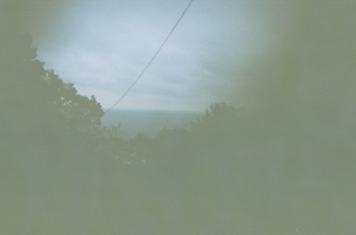
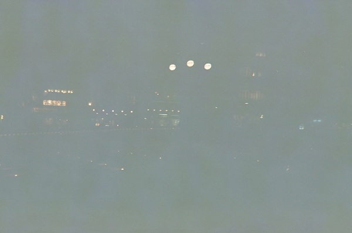
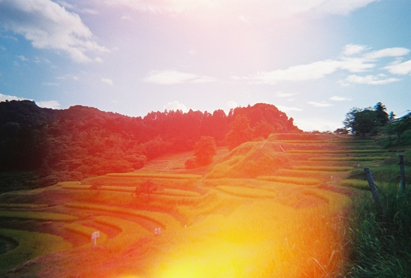
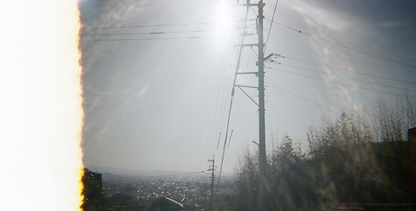
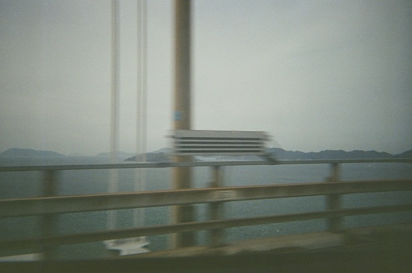

I've been posting my favorite photos I took with my [KODAK M38](/posts/lifelog/2026-08-27_film_camera/):
- [Photos: Izumo, March 2025](/posts/photos/2026-08-06_izumo/)
- [Photos: Kurashiki, March 2026](/posts/photos/2026-08-29_kurashiki/)
- [Photos: Kuhombutsu Joshin-ji Temple (2024 winter)](/posts/photos/2026-09-14_joshin-ji/)

To be honest, there are many failed photos in my album.

Here lie my failed ones...

## Related
- [My Favorite Belonging: KODAK Film Camera M38](/posts/lifelog/2026-08-27_film_camera/)