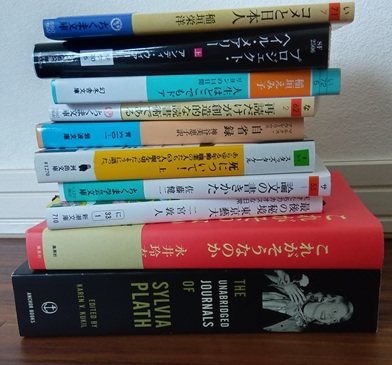

I love bookstores; they're one of my favorite places in the world.

But there's this problem: I buy more books than I can handle.

I prefer buying books in person rather than online. 
That way I can flip through books I'm interested in and decide whether I should buy them at that time.

It's not common to find a book you've been wanting to read in a bookstore.  
So whenever I find one, I cannot help but think "I might not be able to find the same book later!".  
That's why I end up buying at least a few books every time I go to a bookstore.  

Now I have a stack of books I have bought but haven't read yet.  
I have to stop myself from buying more, seriously!

