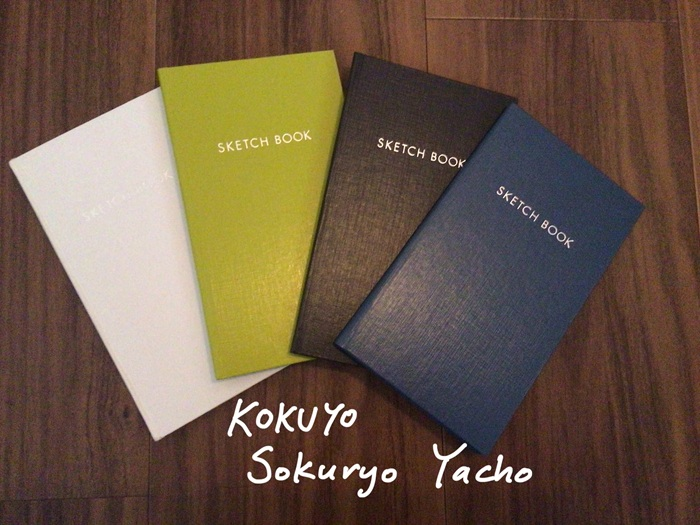

*[日本語で読む](/ja/posts/stationery/2026-09-07_sokuryo_yacho)*

When I go out, I always bring my pocket notebook with me.  
I take it out in a cafe, in a waiting room, or in a train (only when few people are around though).  
I started carrying it with me after I watched video essays on pocket notebooks, and now it's my must-have.  

I tried to carry around A5 notebooks, soft cover pocket notebooks and so on, but in the end I end up with KOKUYO Sokuryo Yacho.  

Here are the reasons I love this notebook:
- It's small and thin enough to fit in my handbag (and my pocket), but it feels like it has plenty of pages
- Hard cover. I can write comfortably anywhere!
- Beautiful color variations
- It's cheaper than it looks (the basic one is less than 300 yen)!
- Made in Japan. It feels nice to use something that's made in your own country, right?

## Related
- [Sketches (June 24 - June 26)](/posts/drawing/2026-07-09_sketches)
- [Sketches (July 6 - July 15)](/posts/drawing/2026-08-03_sketches)
- [Sketches (August 1 - August 11)](/posts/drawing/2026-09-04_sketches)