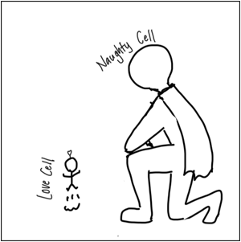

Here in Japan, 유미의 세포들 3 (Yumi's Cells 3) is only available on Disney+ (as far as I know).

I never fully watched Seasons 1 and 2; I only checked highlights and teasers on YouTube (tvN DRAMA channel) to grasp the basic story.

Then came Season 3.  

Here's the trailer:  
<iframe width="560" height="315" src="https://www.youtube.com/embed/c3j5JlU4AvA?si=twdjLbAtXjqSfvJ3" title="YouTube video player" frameborder="0" allow="accelerometer; autoplay; clipboard-write; encrypted-media; gyroscope; picture-in-picture; web-share" referrerpolicy="strict-origin-when-cross-origin" allowfullscreen></iframe>

At first, I watched only highlights and teasers as usual, but as the story progressed, I became eager to watch the full episodes.
So I ended up paying 1,250 yen for a monthly Disney+ subscription and started watching the latest episodes.

Then I was surprised by how happy this series made me!

I especially loved Episodes 7 and 8. I loved them so much that I've already watched them three times haha.  
It was totally worth it.

The most hilarious part for me was Soon-rok's Naughty Cell. I mean, look how huge he is compared to the other cells!  
He even wears **A CAPE**!

## Related
- [Media Log (May 2026)](/posts/lifelog/2026/2026_may_media_log)