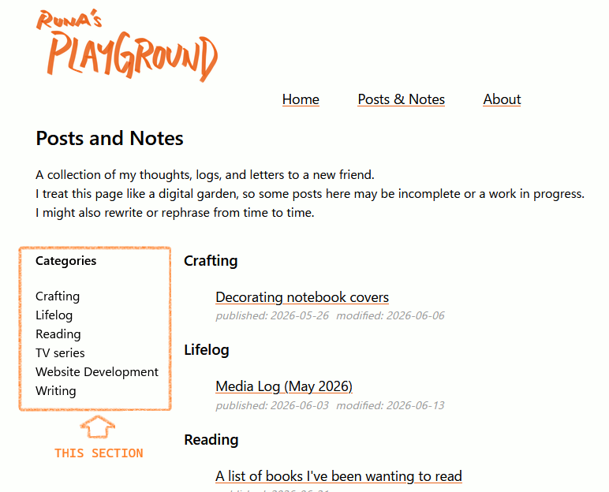
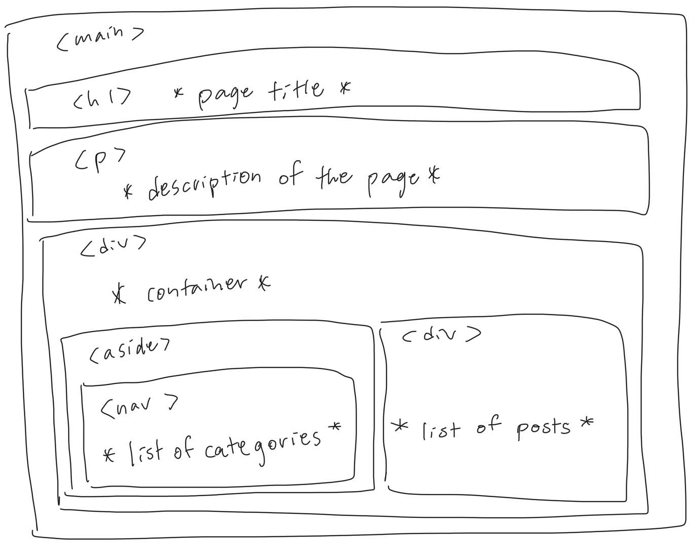
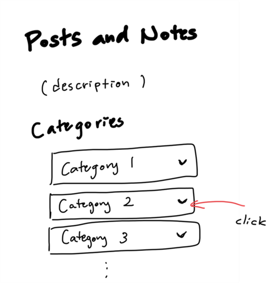
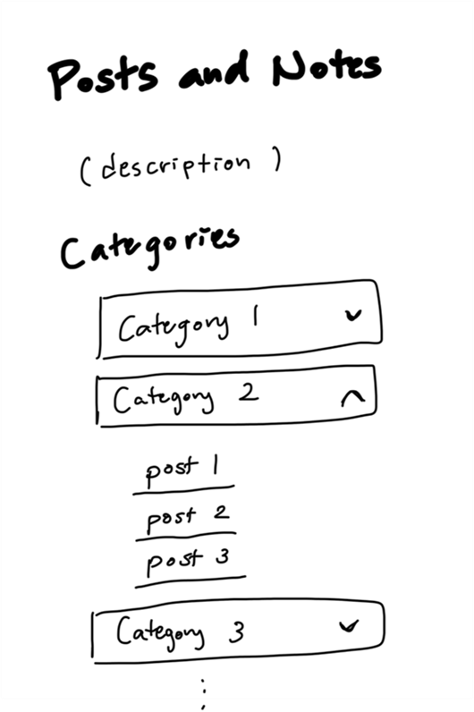

A while ago I added “categories” section to [Posts and Notes](/posts/) page.



Visitors can click a category and jump to the category's posts.  

The structure of the page is like this:



And here’s the css:
```css
div.container {
    display: flex;
}
aside {
    @media (width < calc(57rem)) {
        display: none;
    }
}
nav {
    position: sticky;
    overflow-y: auto;
    top: 0;
}
```
This is one of the features I wanted to add when I first set up this website, but lately I’m starting to feel that it’s unnecessary.  

The "categories" section won't be displayed if the screen width is smaller than 57 rem, so it’s usually hidden when you access the page from your phone.  

Personally I use my phone more than my computer when I read posts, and I think that applies to many smartphone users.  
So what’s the point of adding categories section that can only be displayed on tablets or computers?

I’m starting to think that, instead of adding the categories section to the page,  editing the page like below might be better.

Once you click one of the categories,  



the list of posts under that category will appear.



I haven’t decided if I’m going to make this change yet, though.

## Related
- [Features I want to add to this website](/posts/web-dev/2026-05-20_features_to_add)